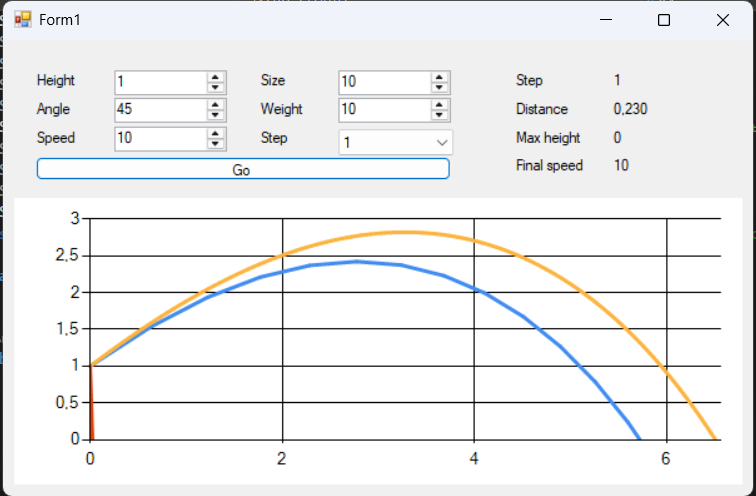

### Моделирование полёта тела в атмосфере

**Задание:**  
Реализовать приложение для моделирования полёта тела в атмосфере.  
Предусмотреть возможность ввода шага моделирования и вывода результатов.

Выполнить моделирование **без очистки предыдущих результатов** для различных шагов моделирования, сравнить траектории и заполнить таблицу:

| Шаг моделирования, с | 1 | 0.1 | 0.01 | 0.001 | 0.0001 |
|----------------------|---|-----|------|-------|--------|
| Дальность полёта, м |   |     |      |       |        |
| Максимальная высота, м | | | | | |
| Скорость в конечной точке, м/с | | | | | |

**Сделать выводы.**

**В отчёт включить:**
- код программы;
- скриншот с несколькими траекториями;
- заполненную таблицу;
- выводы.

# Отчёт по лабораторной работе
## Исследование влияния шага моделирования на точность расчёта траектории полёта тела

### 1. Визуализация траекторий

На рисунке 1 представлены несколько траекторий полёта тела, полученные при различных параметрах моделирования.

*Рисунок 1 - Траектории полёта при различных начальных условиях*

### 2. Результаты численного моделирования

В таблице 1 представлены результаты расчётов дальности полёта, максимальной высоты и конечной скорости при различных шагах моделирования.

**Таблица 1 - Зависимость результатов моделирования от шага интегрирования**

| Шаг моделирования, с | 1      | 0.1    | 0.01   | 0.001  | 0.0001 |
|----------------------|--------|--------|--------|--------|--------|
| Дальность полёта, м  | 0.230  | 5.255  | 5.968  | 6.028  | 6.035  |
| Максимальная высота, м | 0    | 1.424  | 1.824  | 1.865  | 1.869  |
| Скорость в конечной точке, м/с | 10 | 5.574 | 6.340 | 6.399 | 6.406 |

### 3. Анализ полученных результатов

Таблица наглядно демонстрирует **зависимость точности численного моделирования от шага интегрирования**. Для получения достоверных результатов шаг должен быть достаточно мал, чтобы отслеживать динамику системы, но не избыточно мал, чтобы не тратить вычислительные ресурсы впустую.

На основе предоставленной таблицы можно сделать следующие выводы:

#### 3.1 Влияние шага моделирования на точность расчётов

При шаге **1 с** результаты сильно отличаются от остальных:
- Дальность **0.23 м** (вместо ~**6 м**)
- Высота **0 м** (вместо ~**1.87 м**)
- Конечная скорость **10 м/с** (равна начальной, тело почти не замедлилось)

**Вывод:** шаг **1 с** слишком грубый, модель не успевает учитывать изменения скорости и траектории.

При уменьшении шага (**0.1 → 0.0001**) результаты постепенно сходятся к определённым значениям:
- Дальность: **5.255 → 6.035 м**
- Высота: **1.424 → 1.869 м**
- Скорость: **5.574 → 6.406 м/с**

**Вывод:** чем меньше шаг, тем точнее расчёт, так как модель лучше аппроксимирует непрерывный процесс.

#### 3.2 Сходимость решения

Начиная с шага **0.001 с** и **0.0001 с** изменения становятся незначительными:
- Дальность: **6.028 → 6.035** (разница **0.007 м**)
- Высота: **1.865 → 1.869** (разница **0.004 м**)
- Скорость: **6.399 → 6.406** (разница **0.007 м/с**)

**Вывод:** решение сходится к истинным значениям при шаге **≤ 0.001 с**. Дальнейшее уменьшение шага даёт минимальное уточнение.

#### 3.3 Оптимальный шаг моделирования

- Шаг **0.001 с** даёт приемлемую точность (отличие от шага **0.0001** менее **0.2%**)
- Шаг **0.1 с** уже даёт заметную погрешность (**~13%** по дальности)

**Вывод:** для данной задачи оптимальный шаг — **0.001 с** (баланс точности и времени расчёта).

#### 3.4 Физический смысл результатов

- **Дальность** растёт с уменьшением шага, так как модель точнее учитывает сопротивление воздуха
- **Максимальная высота** также увеличивается — при грубом шаге тело "пропускает" пик траектории
- **Конечная скорость** снижается относительно начальной (**10 м/с**), что логично из-за сопротивления воздуха. При шаге **1 с** сопротивления почти нет (**v = 10 м/с**), при точном расчёте — **~6.4 м/с**

### 4. Заключение

Для инженерных расчётов достаточно шага **0.001 с**. Дальнейшее уменьшение шага нецелесообразно из-за роста времени вычислений при незначительном уточнении результатов.
