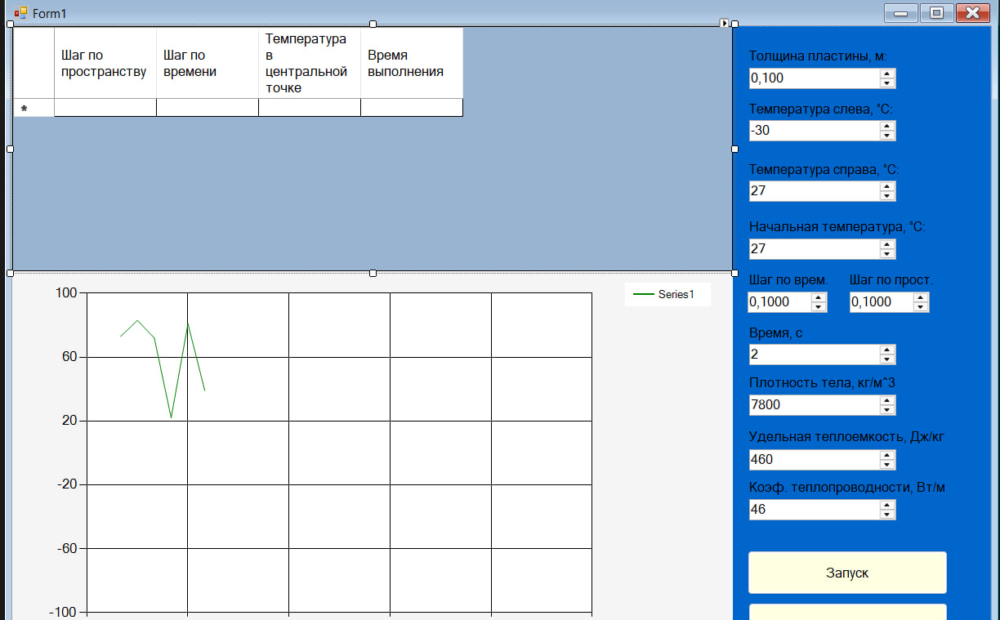

### Метод конечных разностей для уравнения теплопроводности

**Задание:**  
Реализовать моделирование изменения температуры в пластине на основе одномерного уравнения теплопроводности с использованием метода конечных разностей.

Выполнить моделирование с различными шагами по времени и по пространству.  
Заполнить таблицу значений температуры в центральной точке пластины после 2 секунд модельного времени.

| Шаг по времени, с \ Шаг по пространству, м | 0.1 | 0.01 | 0.001 | 0.0001 |
|-------------------------------------------|-----|------|-------|--------|
| 0.1 | | | | |
| 0.01 | | | | |
| 0.001 | | | | |
| 0.0001 | | | | |
### 1. Визуализация траекторий

**Рисунок 1 — Главный экран программы с элементами управления**

На рисунке 1 показан интерфейс программы, включающий:
- **Панель ввода параметров** (слева): поля для ввода плотности, теплоёмкости, 
  коэффициента теплопроводности, геометрических размеров и граничных условий
- **График распределения температуры** (в центре): визуализация T(x) в реальном времени
- **Таблицу результатов** (внизу): отображение температуры в центральной точке и 
  времени выполнения расчёта
- **Кнопки управления**: "Запуск" для начала расчёта, "Очистить" для сброса результатов

## ПАРАМЕТРЫ МОДЕЛИ И УСЛОВИЯ ЗАДАЧИ

| Параметр | Обозначение | Значение | Ед. изм. |
|----------|-------------|----------|----------|
| Плотность | ρ | 7800 | кг/м³ |
| Удельная теплоёмкость | c | 460 | Дж/(кг·°C) |
| Коэфф. теплопроводности | λ | 46 | Вт/(м·°C) |
| Толщина пластины | L | 0.1 | м |
| Начальная температура | T₀ | 20 | °C |
| Температура слева (граница) | T_L | -100 | °C |
| Температура справа (граница) | T_R | 70 | °C |
| Время моделирования | t_max | 10 | с |

---

## РЕЗУЛЬТАТЫ МОДЕЛИРОВАНИЯ

### Таблица 1: Температура в центральной точке пластины после 10 с модельного времени

| τ, с \ h, м | 0.1 | 0.01 | 0.001 | 0.0001 |
|-------------|-----|------|-------|--------|
| **0.1** | 70.0000 °C | 70.0000 °C | 70.0000 °C | 70.0000 °C |
| **0.01** | 19.6851 °C | 19.6941 °C | 19.6946 °C | 19.6951 °C |
| **0.001** | 19.8615 °C | 19.8715 °C | 19.8725 °C | 19.8726 °C |
| **0.0001** | 19.8633 °C | 19.8733 °C | 19.8734 °C | 19.8744 °C |

### Таблица 2: Реальное время выполнения программы (секунды)

| τ, с \ h, м | 0.1 | 0.01 | 0.001 | 0.0001 |
|-------------|-----|------|-------|--------|
| **0.1** | 0.018 с | 0.101 с | 1.235 с | 10.441 с |
| **0.01** | 0.031 с | 0.293 с | 2.554 с | 24.609 с |
| **0.001** | 0.198 с | 1.780 с | 17.401 с | 168.286 с |
| **0.0001** | 1.740 с | 16.451 с | 164.471 с | 1700.170 с |

---

## 3. АНАЛИЗ И ВЫВОДЫ

### 3.1 Сходимость решения

**При грубом шаге по времени τ = 0.1 с:**

Решение **некорректно**: температура во всех узлах (включая центр) принимается равной температуре правой границы (70°C). 

Это говорит о том, что шаг слишком велик для корректного учета:
- инерции теплового процесса
- влияния левой границы

**При уменьшении шага до τ = 0.01 с:**

Решение **стабилизируется**, температура в центре падает до реалистичного значения **≈19.69°C**.

**При дальнейшем уменьшении шагов (τ ≤ 0.001, h ≤ 0.001):**

Наблюдается **сходимость решения** к значению:

Разница между результатами при шагах 0.001 и 0.0001 составляет **менее 0.001°C**, что свидетельствует о достижении предельной точности для данной задачи.

### 3.2 Анализ производительности

- Время расчета растет **квадратично** с уменьшением шагов
- При h = 0.0001 и τ = 0.0001 время расчета составляет **~28 минут** (1700 с)
- При h = 0.001 и τ = 0.001 время расчета составляет **~17 секунд**

---

## 4. ИТОГОВЫЙ ВЫВОД

В ходе работы была успешно реализована программа для моделирования теплопроводности **методом конечных разностей**.

### Оптимальные параметры для данной задачи:

**Этот выбор обеспечивает:**
- ✅ Точность результата до **сотых долей градуса**
- ✅ Время расчета **менее 3 секунд**

### Недопустимые параметры:

❌ **Шаг τ = 0.1 с** является недопустимо большим и приводит к **ошибочным результатам**.

### Эффективность метода:

**Метод прогонки** показал высокую эффективность для решения возникающей трехдиагональной системы линейных уравнений.

